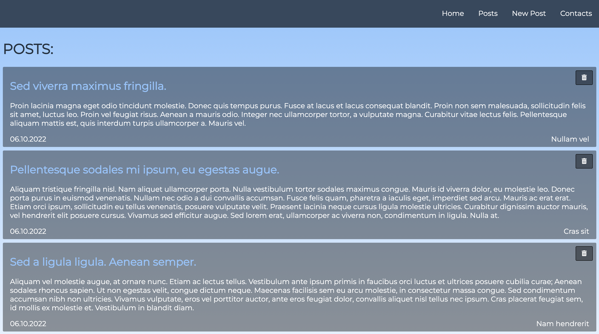

# Demo Node.js

## Описание

Небольшой демо-проект для знакомства с [Node.js](https://nodejs.org/en/about/)

## В проекте разобраны

- Создание сервера
- Создание базового роутинга
- Подключение шаблонизатора [EJS](https://ejs.co/)
- Подключение [Express](https://expressjs.com/)
- Промежуточное ПО (Middleware)
- Обработка POST запроса
- Интеграция БД в приложение [MongoDB](https://www.mongodb.com/)
- Добавление, получение, удаление и редактирование данных
- MVC и Роутер
- Создание API
- Загрузка приложения на Heroku.com
